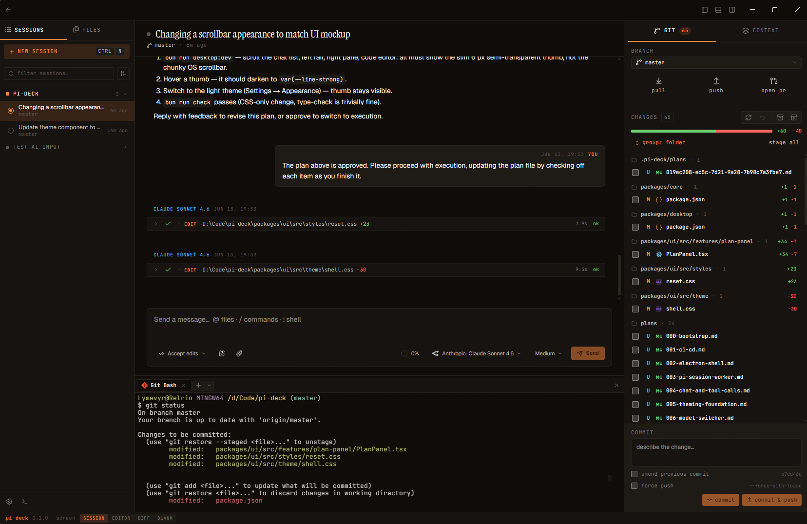

<div align="center">

# pi-deck

**A friendly desktop client for the [pi coding agent](https://github.com/earendil-works/pi).**

[](https://github.com/Relrin/pi-deck/actions/workflows/ci.yml)
[](LICENSE)
[](#quick-start)



</div>

## Why pi-deck
Because the [pi](https://github.com/earendil-works/pi) coding agent was made with the intention to be adaptable to the devs workflows, I have decided to make something that would fit my needs. Specifically:
- Have something similar to the out-of-the-box feel of Cursor 
- Provides a plan mode & tools approvals, because it helps to me to be in control
- Better experience with reviewing changes
- Be in touch with code & terminals (per session) 

## Features

- **Compatible with pi sessions** - Sessions created in the `pi` CLI appear automatically
- **Plan mode** - Think a problem through with the agent and agree on a plan *before* an actual implementation
- **Tool-call approvals** - Decide which tools the agent may run, globally or per session
- **Git review workflow** - A status sidebar with branch switching and commit / push / pull / stash, per-turn review of the agent's edits, and a dedicated diff view
- **Code editor** - Simple syntax highlighting, a live git diff gutter (per-block revert and jump-to-diff), search, go-to-line, and encoding / line-ending controls in the status bar
- **Optional LSP support** - With enabling LSP you can add additional capabilities, such as inline diagnostics, signature help, go-to-definition, etc
- **Terminal support** - A PTY-backed bottom dock with OS-aware shell detection
- **Multi-session UI** - A project switcher and parallel sessions, with conversations and attachments
- **Theming** - Bundled dark / light palettes plus VS Code theme import
- **WSL-aware** - Open a project from `\\wsl.localhost\<distro>\...` and the file tree, terminal, and language servers all run against the distro
- **Cross-platform** - Windows, Linux, and macOS (Apple Silicon), with the same feature set everywhere

### Language servers (LSP)

Out of the box the editor offers basic, buffer-only completion. Installing a language server unlocks the rest: project-wide completion, hover types and docs, live diagnostics (underlines, gutter markers, and error / warning counts in the footer), signature help, rename, and go-to-definition across files.

Nothing is bundled with the app. pi-deck detects servers on your `PATH` and starts them automatically when you open a matching file. A missing server just shows an installation hint in the footer and in **Settings → Editor**.

| Language | Server | How to install |
| --- | --- | --- |
| TypeScript / JavaScript | `typescript-language-server` | `npm install -g typescript-language-server typescript` |
| CSS / SCSS / Less, HTML, JSON | `vscode-langservers-extracted` | `npm install -g vscode-langservers-extracted` |
| Python | `pyright` | `npm install -g pyright` |
| Rust | `rust-analyzer` | `rustup component add rust-analyzer` |
| Go | `gopls` | `go install golang.org/x/tools/gopls@latest` |

Good to know:

- **WSL projects** - for projects opened from `\\wsl.localhost\<distro>\...`, servers are detected and run *inside* that distro. Install them there (e.g. `npm install -g typescript-language-server typescript` inside Ubuntu), not on Windows.
- **Settings → Editor** lists every supported server for the current project (detected / running / not found, with the install hint), lets you toggle each one, and has a *Re-detect servers* button for after you install something.
- Servers start lazily per project, shut down after sitting idle, and are always cleaned up when pi-deck quits.

## Quick start

Grab the latest installer for your OS from [releases](https://github.com/Relrin/pi-deck/releases):

- **macOS** - `.dmg` or `.zip` (Apple Silicon)
- **Windows** - `.exe` installer or portable `.zip`
- **Linux** - `.AppImage` or `.deb`

You'll also need:

- [pi](https://pi.dev/) installed and signed in to at least one provider (`pi auth login ...`).
- [Git](https://git-scm.com/) on your `PATH` for the git sidebar.

pi-deck reads from pi's own data directory, so any sessions you've already created in pi show up as soon as you point pi-deck at the project.

## Building from source

To build pi-deck from source you'll need:

- [Bun](https://bun.sh) (the version pinned in `package.json#packageManager`)
- Node.js 24 or newer (required for downstream tooling such as Electron and `node-pty`)

Then run the following commands to make sure everything is in order:

```bash
bun install
bun run check        # lint + format + type-check - must be green before commits
bun run test         # the full test suite
bun run desktop:dev  # run the Electron app in dev mode
```

`bun run check` is wired into the pre-commit hook via Husky. Don't disable it.

Before opening a PR, please read [AGENTS.md](AGENTS.md) - it covers the architecture, conventions, and where data lives.

## License

pi-deck is published under the MIT license. See [LICENSE](LICENSE) for details.
